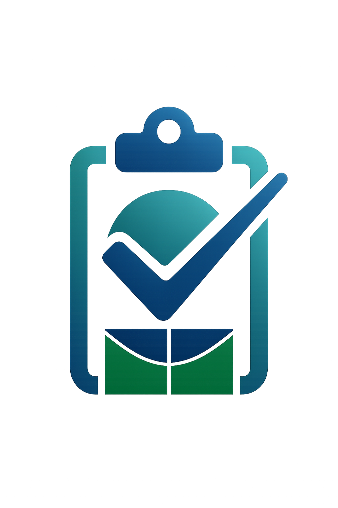

# Check.Acess

## Introdução

Este repositório tem como propósito fornecer um checklist prático de acessibilidade para projetos, principalmente de desenvolvimento de software, que incluem: desenvolvimento web, design, geração de conteúdo e gestão de projetos. 

## Chek.Acess

O Check.Acess é um projeto criado a partir do curso de Interação Humano Computador, ministrado pela docente Rejane Maria da Costa Figueiredo, na Universidade de Brasília (UnB). Ele surge como uma evolução do projeto VerificAAA, desenvolvido em um semestre anterior. Nesse sentido, seu objetivo final é fornecer um checklist prático de acessibilidade para projetos, principalmente de desenvolvimento, que incluem: desenvolvimento web, design, geração de conteúdo e gestão de projetos. Para isso, realizamos melhorias significativas e adicionamos novos critérios baseados na recente NBR 17225 de acessibilidade digital.

## Contribuidores

<table>
  <tr>
    <td align="center"><a href="https://github.com/diogo-barboza"> <b>Diogo Barboza</b></a> 
    <td align="center"><a href="https://github.com/Edzada"> <b>Esdras</b></a>    
    <td align="center"><a href="https://github.com/gravelylara"> <b>Lara</b></a>    
    <td align="center"><a href="https://github.com/RafaelSchadt"> <b>Rafael Schadt</b></a> 
  </tr>
</table>
